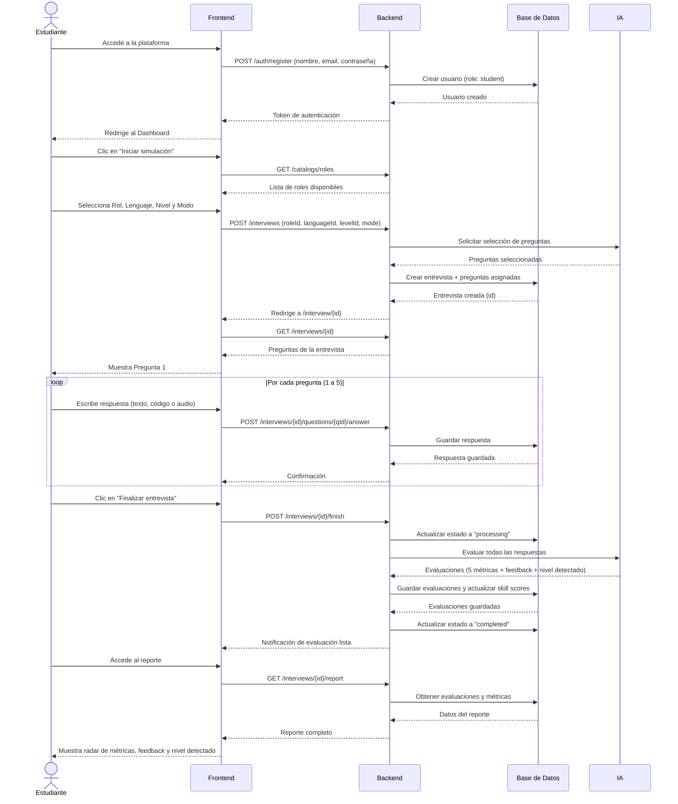

# Diagrama de Secuencia - Flujo Principal de Vinki

## Flujo completo: Registro, Entrevista y Evaluación

```mermaid
sequenceDiagram
    actor Estudiante
    participant Frontend
    participant Backend
    participant Base de Datos
    participant IA

    %% Registro e inicio de sesión
    Estudiante->>Frontend: Accede a la plataforma
    Frontend->>Backend: POST /auth/register (nombre, email, contraseña)
    Backend->>Base de Datos: Crear usuario (role: student)
    Base de Datos-->>Backend: Usuario creado
    Backend-->>Frontend: Token de autenticación
    Frontend-->>Estudiante: Redirige al Dashboard

    %% Configuración de entrevista
    Estudiante->>Frontend: Clic en "Iniciar simulación"
    Frontend->>Backend: GET /catalogs/roles
    Backend-->>Frontend: Lista de roles disponibles
    Estudiante->>Frontend: Selecciona Rol, Lenguaje, Nivel y Modo
    Frontend->>Backend: POST /interviews (roleId, languageId, levelId, mode)
    Backend->>IA: Solicitar selección de preguntas
    IA-->>Backend: Preguntas seleccionadas
    Backend->>Base de Datos: Crear entrevista + preguntas asignadas
    Base de Datos-->>Backend: Entrevista creada (id)
    Backend-->>Frontend: Redirige a /interview/{id}

    %% Sesión de entrevista
    Frontend->>Backend: GET /interviews/{id}
    Backend-->>Frontend: Preguntas de la entrevista
    Frontend-->>Estudiante: Muestra Pregunta 1

    loop Por cada pregunta (1 a 5)
        Estudiante->>Frontend: Escribe respuesta (texto, código o audio)
        Frontend->>Backend: POST /interviews/{id}/questions/{qId}/answer
        Backend->>Base de Datos: Guardar respuesta
        Base de Datos-->>Backend: Respuesta guardada
        Backend-->>Frontend: Confirmación
    end

    %% Finalización y evaluación
    Estudiante->>Frontend: Clic en "Finalizar entrevista"
    Frontend->>Backend: POST /interviews/{id}/finish
    Backend->>Base de Datos: Actualizar estado a "processing"
    Backend->>IA: Evaluar todas las respuestas
    IA-->>Backend: Evaluaciones (5 métricas + feedback + nivel detectado)
    Backend->>Base de Datos: Guardar evaluaciones y actualizar skill scores
    Base de Datos-->>Backend: Evaluaciones guardadas
    Backend->>Base de Datos: Actualizar estado a "completed"
    Backend-->>Frontend: Notificación de evaluación lista

    %% Consulta de resultados
    Estudiante->>Frontend: Accede al reporte
    Frontend->>Backend: GET /interviews/{id}/report
    Backend->>Base de Datos: Obtener evaluaciones y métricas
    Base de Datos-->>Backend: Datos del reporte
    Backend-->>Frontend: Reporte completo
    Frontend-->>Estudiante: Muestra radar de métricas, feedback y nivel detectado
```
